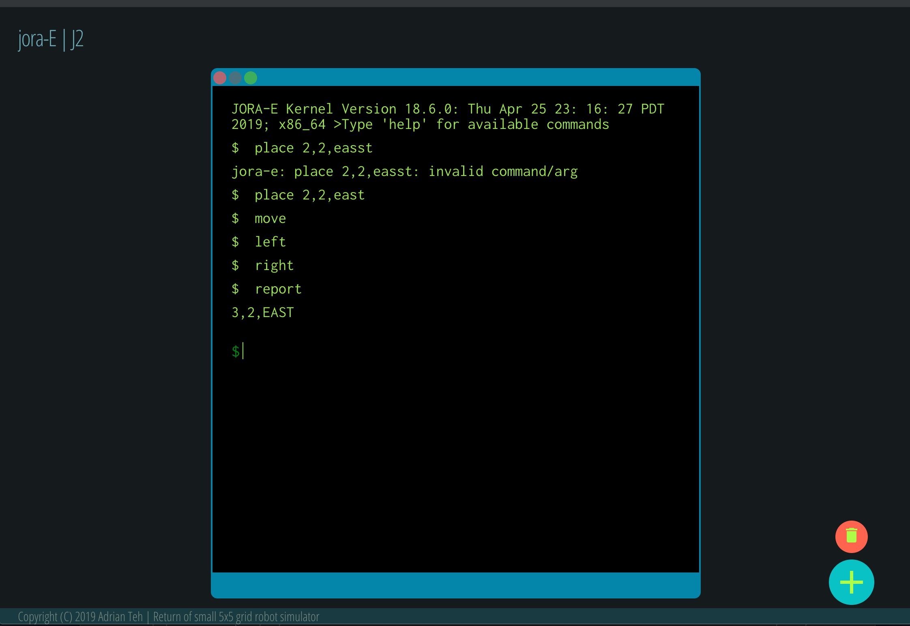

# JORA-E J2
The return of JORA-E, a 5x5 toy robot simulator..

## DESCRIPTION

In this epic sequel J2, JORA-E returns as a faster smaller pdated SkyneXt model. The newly enchanced robot has few changelog entries but only features carried over such as 5x5 grid, ruleset and asthetic designs if even visible at all. Even shockingly, it may contain parts or snippets of the origin source code (from J1). However, under the tin-man rover that we operate remotely is now a terminal console with;

The available commands;
- PLACE X,Y,F where F is (NORTH|EAST|WEST|SOUTH)
- MOVE
- LEFT
- RIGHT
- REPORT

Example, place in point (0,4) facing north
```
PLACE 0,4,NORTH MOVE MOVE LEFT
```



### Requirements
* Node >10
* NPM/YARN *

### Dependencies
* React v16.8.6
* Styled-Components v4.3.2
* RxJS

---

## QUICK START

```
$ yarn start
```

## TESTING

```
$ yarn test
```

## ISSUES

- The two float buttons are placeholders and is not implemetned


## ACKNOWLEDGEMENTS

- This project is bootstrapped with 'Create React App'
- [color-hex][2] underwater scene pallete
- References from article
    - [React hooks state management][3]
    - [Redux architecture][4]

---

[1]: https://github.com/daxeh/jora-e-client
[2]: https://www.color-hex.com/color-palette/74932
[3]: https://medium.com/simply/state-management-with-react-hooks-and-context-api-at-10-lines-of-code-baf6be8302c
[4]: https://dev.to/hirodeath/similar-redux-architecture-example-powered-by-react-hooks-api-hdg

###### DISCLAIMER

<sup><sup><sup>This project and its creators are not affiliated with Wall-E or Terminator,
any motion picture corporation, any television corporation, parent, or affiliate corporation.
All motion pictures, products, and brands mentioned on this project are the respective trademarks
and copyrights of their owners. All material on this website is intended for humorous entertainment
(satire ) purposes only. The content on this project is not necessarily true and should not
be regarded as truth. This piece of legal disclaimer is of course, scrapped off from [elsewhere][2].</sup></sup></sup>
